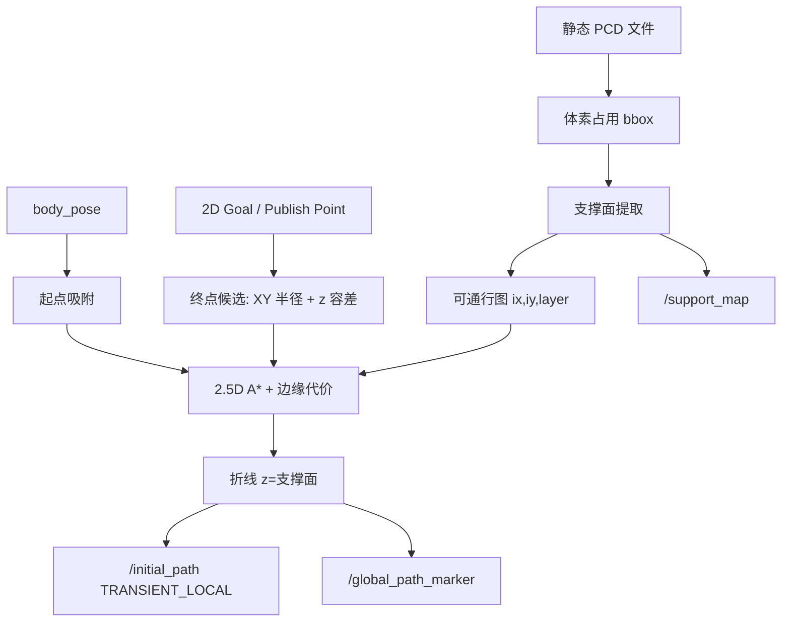

# SCAN-Planner 静态 PCD 支撑面全局规划方案

> 包名：`global_path_planner`  
> 定位：在已有点云地图上生成三维折线先验，供 `scan_planner` **Mode 3**（`/initial_path`）使用；局部避障仍由滑动栅格 + rebound B 样条完成。  
> 适用对象：四足等地面机器人（坡道 / 楼梯 / 多层），非无人机自由空间规划。

---

## 1. 问题与边界

### 1.1 要解决什么

- 输入：静态 **PCD** 点云地图 + 当前位姿 + 三维目标点  
- 输出：世界系下的 **`nav_msgs/Path`**（路径点 z = **支撑面/地面高度**）  
- 角色：Mode 3 的**全局先验路径生产者**，不替代局部规划器

### 1.2 明确不做什么

| 不做 | 原因 |
|------|------|
| 扩大 `plan_env::GridMap` 为整栋楼滑动图 | 局部图分辨率细、尺度大时内存不可行 |
| 复用 `path_searching::AStar` 做楼栋尺度搜索 | 绑滑动图、搜索池约 5 m、z 仅起终点插值 |
| 在全局阶段做精细动态避障 | 交给 Mode 3 局部 rebound |
| 依赖 Gazebo / OctoMap / 外部全局规划包 | 自研、与 SCAN 栈解耦清晰 |

### 1.3 与局部规划的分工

```
静态 PCD ──► global_path_planner ──► /initial_path
                                         │
                                         ▼
                              SCANReplanFSM (Mode 3)
                                         │
                    prepareReferenceWaypoints (z += body_height)
                                         │
                              min-snap 多项式全局参考
                                         │
                              局部 rebound B 样条 + 滑动 GridMap
```

---

## 2. 总体架构

### 2.1 包结构

```
global_path_planner/
├── include/global_path_planner/
│   ├── support_map.hpp      # PCD→占用→支撑面
│   └── support_astar.hpp    # 支撑面 2.5D A*
├── src/
│   ├── support_map.cpp
│   ├── support_astar.cpp
│   ├── global_path_planner_node.cpp
│   └── offline_plan_smoke.cpp
├── config/global_planner.yaml
└── test/test_support_astar.cpp
```

### 2.2 核心模块

| 模块 | 职责 |
|------|------|
| `SupportMap` | 加载 PCD，构建粗分辨率占用体素，提取每列可站立支撑高度（可多层） |
| `SupportAstar` | 在支撑图上做 8 邻接 2.5D A*，带台阶约束、边缘代价、目标高度过滤 |
| `global_path_planner_node` | ROS 接口：里程计起点、Goal / Publish Point、发布 `/initial_path` 与可视化 |

### 2.3 数据流



---

## 3. 地图表示：从 PCD 到支撑面

### 3.1 粗分辨率占用

1. `pcl::io::loadPCDFile` 读入点云  
2. 计算 AABB，按 `pad_xy` / `pad_z` 扩边  
3. 以 `resolution`（默认 0.2 m）离散为稠密 3D 占用栅格：有点落入则 `occupied=1`

设计取舍：全局用粗分辨率，保证楼栋尺度内存与搜索时间可控；细节避障留给局部 0.05 m 滑动图。

### 3.2 支撑面定义（四足可站立）

对每个平面格 `(ix, iy)`，沿 z 扫描占用柱：

- 取占用柱的**顶部**体素  
- 其上方至少 `min_clearance` 高度内无占用（机身净空）  
- 记录支撑高度：`z = origin.z + (iz + 1) * resolution`（体素顶面）

同一 `(ix, iy)` 可有**多层**支撑（楼板叠层），存为 `supports_[ix,iy] = [z0, z1, ...]`。

`/support_map` 发布的是这些支撑采样点，**不是**原始 PCD 拷贝：覆盖整图范围，但点数按栅格下采样，且仅含满足净空的表面。

### 3.3 机身碰撞（全局粗糙）

`isBodyCollisionFree(ix, iy, layer)`：

- 在高度约 `support_z + robot_height` 处取水平圆盘  
- 半径 `robot_radius`（与局部 `double_cylinder_radius` 对齐）  
- 圆盘内对应体素若占用则判撞

用于可通行性过滤，不替代局部双圆柱精细模型。

---

## 4. 搜索算法：支撑面 2.5D A*

### 4.1 状态空间

- 节点：`(ix, iy, layer)` —— 平面格 + 该格上的某一支撑层  
- 邻接：平面 8 邻接；目标格上每一层 `k` 若满足台阶约束则可扩展

### 4.2 约束与代价

| 项 | 规则 |
|----|------|
| 台阶 | `\|z_next - z_cur\| ≤ max_step_height` |
| 碰撞 | 目标格 `isBodyCollisionFree` |
| 基础代价 | 平面步长 × `resolution`（对角 √2） |
| 高度变化 | `0.1 * \|dz\|` |
| **边缘代价** | `edge_cost_weight * resolution * incompatibleNeighborCount` |

**边缘代价**（抑制楼梯侧爬、贴悬崖）：

- 对当前格的 8 邻域，统计「无支撑」或「所有支撑层与当前 z 差均 > max_step」的邻居数  
- 楼梯口正中：左右多为同高支撑，惩罚小  
- 贴楼梯侧边：一侧掉到楼下/悬空，惩罚大 → 更倾向从楼梯正面/中部攀爬

### 4.3 起终点吸附

**起点**

- 默认用 `body_pose`；里程计为机身高度时减去 `robot_height`，得到地面高度再吸附  
- 在 `xy_snap_radius` 内找最近可通行支撑

**终点候选（重要）**

1. 在目标 XY 的 `xy_snap_radius` 内收集支撑  
2. **高度过滤**：只保留与参考高度差 ≤ `goal_z_tolerance` 的支撑  
   - Publish Point / 带真实 z 的目标：参考 = `goal.z`  
   - 2D Goal Pose（z≈0）：参考 = **起点支撑高度**（同层点目标）  
3. A* 以过滤后的集合为多目标；启发式偏向优选终点

这样可避免：机器在 3 m 层、目标点在 1 楼时，因同 XY 高层也被标成终点而「本层走完即成功」。

### 4.4 输出

- 回溯路径 → 世界坐标折线（z = 支撑面）  
- 按 `path_min_distance`（默认 0.5 m）下采样，与 Mode 3 `prepareReferenceWaypoints` 一致  
- QoS：`/initial_path` 使用 **RELIABLE + TRANSIENT_LOCAL**，保证晚启动的 FSM 仍能收到

---

## 5. ROS 接口

### 5.1 节点

`global_path_planner_node`（包 `global_path_planner`）

### 5.2 订阅

| 话题（节点内名） | 类型 | Remap（launch） | 含义 |
|------------------|------|-----------------|------|
| `body_pose` | `nav_msgs/Odometry` | `/quad_0/body_pose` 或真机 LIO | 规划起点 |
| `goal` | `geometry_msgs/PoseStamped` | `/move_base_simple/goal` | RViz 2D Goal Pose |
| `clicked_point` | `geometry_msgs/PointStamped` | `/clicked_point` | RViz Publish Point（推荐点 `/support_map`） |

两种目标输入并存，共用 `planToGoal()`。

### 5.3 发布

| 话题 | 类型 | 说明 |
|------|------|------|
| `initial_path` | `nav_msgs/Path` | Mode 3 先验；z = 地面/支撑高度 |
| `global_path_marker` | `visualization_msgs/Marker` | 路径线 |
| `support_map` | `sensor_msgs/PointCloud2` | 支撑面可视化 |

### 5.4 Launch 接入

`run.launch.py` 在 `navi_mode:=3` 且 `enable_global_planner:=true` 时启动本节点：

- PCD：`global_planner_pcd` 或默认复用 `pcd_map_file`  
- 与 `reference_path_file`（YAML 演示发布器）**互斥**

示例：

```bash
ros2 launch scan_planner run.launch.py \
  is_real_world:=false navi_mode:=3 controller_mode:=open_loop \
  use_pcd_map:=true \
  pcd_map_file:=/path/to/map.pcd \
  enable_global_planner:=true
```

RViz：`2D Goal Pose` 或对 `/support_map` 使用 **Publish Point**。

---

## 6. 与 Mode 3 的契约

| 约定 | 说明 |
|------|------|
| 路径 z | **地面/支撑高度**，不要发机身高度 |
| FSM | `pathCallback` → `prepareReferenceWaypoints` 对每个点 **再加** `grid_map.body_height` |
| 全局曲线 | 先验折线 → min-snap 多项式 `GlobalTrajData` |
| 局部 | `planning_horizon` 前视 + rebound；Mode 3 重规划不重新以 odom 锚定全局多项式 |

`robot_height` 应与 `planner.yaml` 中 `grid_map.body_height` 保持一致，避免「减一次、加一次」尺度错位。

---

## 7. 关键参数

配置文件：`config/global_planner.yaml`

| 参数 | 典型值 | 作用 |
|------|--------|------|
| `resolution` | 0.2 | 全局体素边长；越小越细、越慢 |
| `min_clearance` | 0.5～1.0 | 支撑上方净空；过大剔掉矮通道 |
| `robot_radius` | 0.25 | 水平膨胀，对齐局部圆柱半径 |
| `robot_height` | 0.4 | 机身离地；起点换算与碰撞检查高度 |
| `max_step_height` | 0.40 | 相邻支撑最大落差（台阶/缓坡） |
| `xy_snap_radius` | 1.5 | 起终点平面吸附半径 |
| `goal_z_tolerance` | 0.6 | 终点只保留接近目标高度的支撑层 |
| `edge_cost_weight` | 0.4～2.0 | 边缘/侧爬惩罚；越大越靠通道中心 |
| `path_min_distance` | 0.5 | 输出折线下采样间距 |

调参经验：

- 跨层点错楼：查 `goal_z_tolerance` 与 Publish Point 的 z  
- 贴楼梯边爬：加大 `edge_cost_weight`  
- 挤不过窄道 / 先验贴墙：加大 `robot_radius`（并与局部膨胀一致）  
- 缓坡规划失败：略增 `max_step_height` 或减小 `resolution`

---

## 8. 设计取舍小结

1. **支撑面 2.5D，而非全 3D 自由飞** —— 贴合四足可站立语义，状态空间小一个数量级。  
2. **粗全局 + 细局部** —— PCD 全局 0.2 m；局部滑动 0.05 m 做真实避障。  
3. **先验只保证拓扑可达与大致几何** —— 楼梯口、窄缝的最终可行性由局部优化兜底。  
4. **目标高度过滤 + 边缘代价** —— 分别解决「错层当终点」与「侧边上楼」两类结构性缺陷。  
5. **独立 ROS 包** —— 不污染 `GridMap` / 局部 A*；Mode 3 契约不变，仅替换 `/initial_path` 生产者。

---

## 9. 已知局限与后续方向

| 局限 | 可能改进 |
|------|----------|
| 楼梯几何未显式建模，仅靠台阶+边缘代价启发式 | 可通行宽度约束、坡度方向代价、显式楼梯检测 |
| 全局碰撞仅为单高度圆盘 | 足迹多边形 / 与局部双圆柱完全一致的膨胀 |
| 静态地图，不在线更新 | 融合增量占用地图或重规划触发 |
| 2D Goal（z≈0）默认同层目标 | 需要跨层时应用 Publish Point 给真实 z |
| 无运动学曲率约束 | 路径后处理平滑或 Dubins/混合 A* |

离线自检：

```bash
ros2 run global_path_planner offline_plan_smoke /path/to/map.pcd
```

单元测试：`colcon test --packages-select global_path_planner`。

---

## 10. 版本关系

- 工作空间：`3d_nav` / `scan_planner` ROS 2 Humble 移植版  
- 本方案作为 Mode 3 的**内置全局先验模块**，与手写 `reference_path_*.yaml` 演示路径并列，由 `enable_global_planner` 切换  

文档对应实现路径：

`src/scan_planner/src/planner/global_path_planner/`
